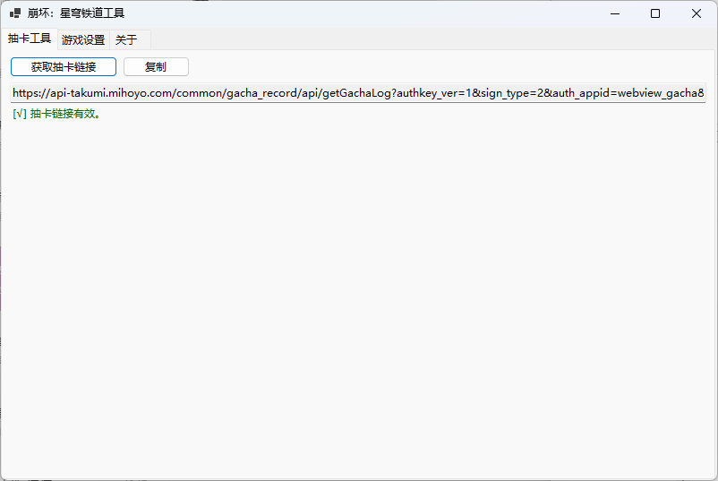
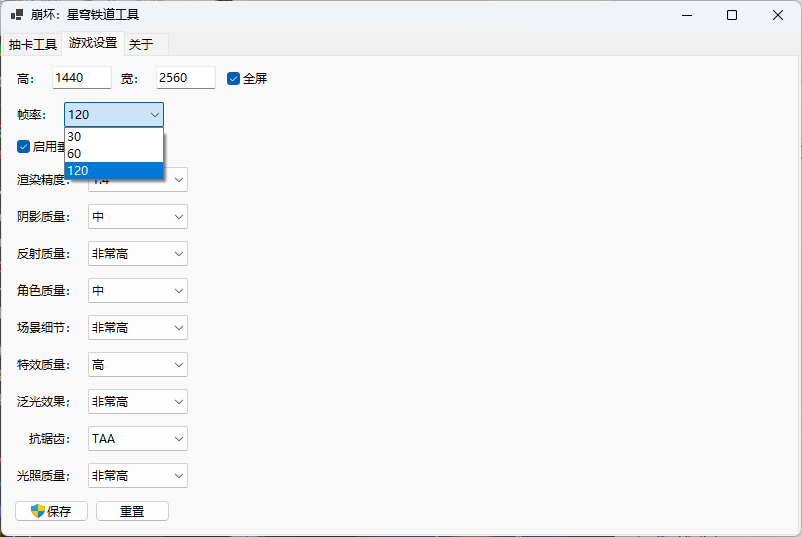

# 崩坏：星穹铁道小工具

## 目前已完成功能
- [x] 一键获取抽卡链接  
- [x] 帧率上限设置为120  
- [x] 图像设置  

## 使用说明
1. 抽卡工具
   - 获取抽卡链接时，请关闭游戏。游戏开启时无法读取链接文件。
   - 如果抽卡链接已过期，请在游戏中打开抽卡界面（哪个卡池无所谓），选择查看详情，点开抽卡历史记录，能看到抽卡记录表格就行。随后关闭游戏，使用该小工具获取。

2. 游戏设置
   - 如果小工具在获取游戏设置时报错，请在游戏中打开图像设置界面，把任意一项设置更改，例如将游戏默认的60帧改成30帧，再按ESC退出设置，确保图像设置保存。如果有需要，后续可以再改回来。
   - 如果您将帧率设置为120，由于崩铁客户端的bug，您将无法在游戏中修改图像设置（因为游戏内没有120帧选项，导致异常了）。但您依旧可以使用本小工具进行图像设置修改。

## 界面预览

